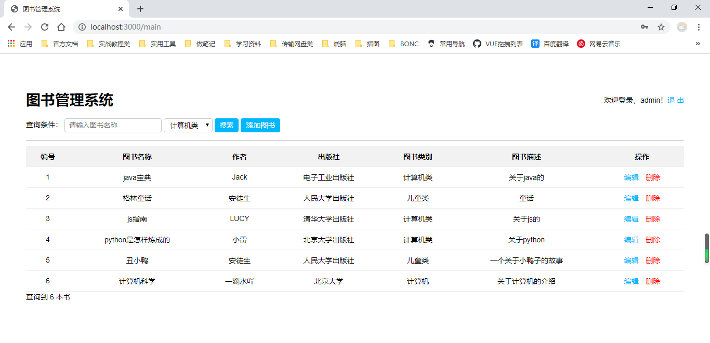

# 基于Nodejs整合图书管理系统

## 项目介绍
基于Nodejs + express + ejs 实现的图书管理系统

## 功能模块

| 模块     |  描述    |   完成情况   |
| -------- | ---- | ---- |
| 图书查询 |  条件查询，查询记录显示    |   ✔   |
| 新增图书 |  完成添加图书功能    |  ✔    |
| 修改图书 |  对已有的图书进行修改操作    |  ✔    |
| 删除图书 |  对已有的图书进行删除操作    |  ✔    |
| 用户登录 |  登录校验、登录拦截、退出登录    |  ✔    |


## 笔记

本系统使用express整合，模版引擎使用的是 ejs

### express
express是nodejs的web框架
npm初始化项目
在当前项目中安装express依赖 

```
npm install express --save
```

配置`app.js`：

```js
const express = require('express') //引入express
const app = express() //使用express创建服务
const port = 3000  //定义端口号

//设置访问路径,并向浏览器响应内容
app.get('/', (req,resp) => resp.send('Hello World'))

//监听端口号
app.listen(port, ()=> console.log('Your app running at http://localhost:3000/'))
```

### Express应用程序生成器
通过应用生成器工具 express-generator 可以快速创建一个应用的骨架，就可以不用手动配置`app.js`了
npx express-generator  [介绍](https://www.expressjs.com.cn/starter/generator.html)

**使用**

```
npx express-generator --view=ejs  （--view=ejs 选择要使用的模板引擎）
```

生成骨架之后，使用npm install 安装所需依赖
在 Windows 中，通过如下命令启动此应用：

> npm start

使用 http://localhost:3000/访问应用，进入登录页面

用户名：admin 密码：123456

**注意**

在使用应用生成器工具 express-generator 生成的项目，项目启动的默认端口号在 /bin/www 文件里面设置

```
15 var port = normalizePort(process.env.PORT || '3000'); //3000为默认端口号，根据自己的需要进行更改
```

### 模板引擎
在使用npx express-generator --view=ejs 时使用模板引擎

## 时间轴

2020-03-27 项目初始化

2020-03-28 定义json数据文件，实现图书查询功能

2020-04-22 完成添加、修改图书功能

2020-04-23 项目首次提交到github

2020-04-24 添加连接mysql配置信息

2020-04-24 图书管理系统基于mysql数据库完成增删改查功能

## 项目截图

1. 用户登录页


2. 图书管理系统首页面



3. 添加图书页面


4. 修改图书页面

